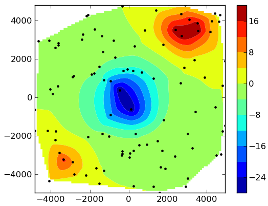

Fatiando a Terra: Geophysical modeling and inversion
====================================================

.. topic:: An open source toolkit for geophysical modeling and inversion

    Fatiando provides an easy and flexible way to perform common tasks like:
    generating synthetic data, forward modeling, inversion, 3D visualization,
    and more! All from inside the powerful Python_ language.

For more information visit `the official site`_.

The **source code** of Fatiando is hosted on `GitHub`_.

.. _GitHub: https://github.com/leouieda/fatiando
.. _the official site: http://www.fatiando.org/software/fatiando
.. _Python: http://www.python.org

**License**: Fatiando is licensed under the **BSD license**.
This means that it can be reused and remixed
with few restrictions.
See the :ref:`license text <license>` for more information.

The best **place to start** learning
about Fatiando is the :ref:`Cookbook <cookbook>`!
There, you'll find many sample scripts
with common tasks
that can help you get started.

As an **example**, this is how easy it is to create synthetic noise-corrupted
gravity data on random points from a 3D prism model:

.. doctest::

    >>> from fatiando.mesher import Prism
    >>> from fatiando.vis import mpl
    >>> from fatiando import gridder, utils, gravmag
    >>> # Create the prism model
    >>> prisms = [
    ...     Prism(-4000, -3000, -4000, -3000, 0, 2000, {'density':1000}),
    ...     Prism(-1000, 1000, -1000, 1000, 0, 2000, {'density':-1000}),
    ...     Prism(2000, 4000, 3000, 4000, 0, 2000, {'density':1000})]
    >>> # Generate 500 random observation points at 100m height
    >>> xp, yp, zp = gridder.scatter((-5000, 5000, -5000, 5000), 500, z=-100)
    >>> # Calculate their gravitational effect and contaminate it with 0.1 mGal
    >>> # gaussian noise
    >>> gz = utils.contaminate(gravmag.prism.gz(xp, yp, zp, prisms), 0.1)
    >>> # Plot the result
    >>> mpl.contourf(xp, yp, gz, (100, 100), 12, interp=True)
    >>> cb = mpl.colorbar()
    >>> cb.set_label('mGal')
    >>> mpl.plot(xp, yp, '.k')
    >>> mpl.show()

which results in something like this:

For those of you not so interested in potential fields,
there is a new module :ref:`fatiando.seismic.wavefd <fatiando_seismic_wavefd>`
for **2D finite difference simulations
of seismic waves**!

.. raw:: html

    <iframe width="560" height="315" 
     src="https://www.youtube.com/embed/Mvd8FANLqy4" 
     frameborder="0" allowfullscreen></iframe>

    <iframe width="420" height="315" 
     src="https://www.youtube.com/embed/YjhSvEpbzps" 
     frameborder="0" allowfullscreen></iframe>

.. raw:: html

    <h1>Contents:</h1>

.. toctree::
    :maxdepth: 1

    contributors.rst
    license.rst
    changelog.rst
    install.rst
    api/fatiando.rst
    cookbook.rst

