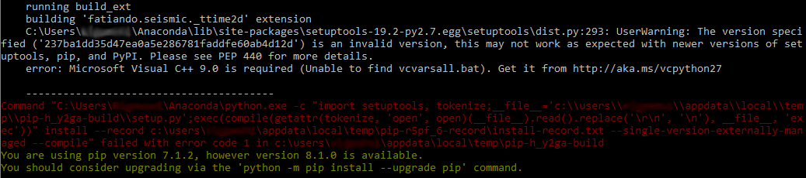

.. _install:

Installing Fatiando
===================

.. note::

    If you have any trouble installing please `submit a bug report on Github`_
    or write to the `mailing list`_.

Which Python?
-------------

For the moment, Fatiando is only tested on **Python 2.7**.
Support for Python >= 3.5 is planned for future releases.
If you'd like to help us add support for Python 3, please get in touch through
the `mailing list`_.

We recommend using the Anaconda_ Python distribution to ensure you have all
dependencies installed and the ``conda`` package manager available.
Installing Anaconda does not require administrative rights to your computer and
doesn't interfere with any other Python installations in your system.

Installing with conda
---------------------

You can install Fatiando and all it's dependencies using the ``conda`` package
manager by running::

   conda install fatiando --channel conda-forge

This command will automatically install a pre-compiled version of Fatiando and
all required :ref:`dependencies <dependencies>`.
The compiled ``conda`` packages are made through the conda-forge_ community-led
organization.

The above command will not install Mayavi automatically because it requires an
older version of numpy (1.9). This means that, if you want to install Mayavi,
you won't be able to use the latest versions of most libraries, particularly
matplotlib > 1.4. However, if you do want Mayavi, you can install Fatiando
compatible numpy 1.9 by using::

    conda install fatiando mayavi --channel conda-forge

Be aware that this will likely downgrade your installed libraries to be
compatible.

Installing with pip
-------------------

You can also install Fatiando using the pip_ package manager::

    pip install fatiando

However, this will require that you already have all :ref:`dependencies
<dependencies>` installed as well as a C compiler.

On **Windows** you might get an error saying that ``Microsoft Visual C++
is required (Unable to find vsvarsall.bat).`` like the following:

This is because you don't have the Microsoft C compiler installed. Follow
the link in the error message (`http://aka.ms/vcpython27
<http://aka.ms/vcpython27>`__) to download the Microsoft Visual C++
Compiler for Python 2.7. Install it and install Fatiando again.

Installing the latest development version
-----------------------------------------

If you want the very latest code and features,
you can install Fatiando directly from Github_.
We try to maintain the *master* branch stable and
`passing all tests <https://travis-ci.org/fatiando/fatiando/branches>`__,
so it should be safe to use.

First, make sure you have all dependencies installed and a C compiler
available (see the pip instructions above).
To install the latest version from Github::

    pip install https://github.com/fatiando/fatiando/archive/master.zip

or if you have git installed and want to see the code::

    git clone https://github.com/fatiando/fatiando.git
    cd fatiando
    pip install -e .

Note that the ``fatiando.__version__``  variable has the current version
number. If you install from PyPI or conda-forge, this will be something like
``'0.2'``. If you installed from Github, this will be the latest commit hash.
This way you can track exactly what version of Fatiando generated your results.

.. _dependencies:

Dependencies
------------

Fatiando requires the following dependencies for running:

* `numpy <http://www.numpy.org/>`_
* `scipy <http://scipy.org/>`_
* `numba <http://numba.pydata.org/>`__
* `future <http://python-future.org/>`_
* `matplotlib <http://matplotlib.org/>`_
* `pillow <http://python-pillow.org/>`_

The following are also recommended but optional:

* `Jupyter <http://jupyter.org/>`__: for running the Jupyter notebook and
  interactive widgets.
* `basemap <http://matplotlib.org/basemap/index.html>`__: matplotlib toolkit
  for plotting maps with projections.
* `mayavi <http://code.enthought.com/projects/mayavi/>`_: for 3D plotting.

You can install all of these dependencies using ``conda`` by running the
following command on a terminal (or ``cmd.exe`` on Windows)::

    conda install numpy scipy numba future matplotlib pillow jupyter basemap mayavi

Testing the install
-------------------

You can test your install by running our test suite. We use `py.test`_ to
manage our tests, so you'll need to have it installed. You can do this by
running ``conda install pytest`` if you use ``conda`` or ``pip install pytest``
if you use ``pip``. After that, you can run the tests by running the following
in the Python (or IPython) interpreter::

    import fatiando
    fatiando.test()

Alternatively, you can run the following from the command line (or
``cmd.exe``)::

    python -c "import fatiando; fatiando.test()"

That should run all our automated tests (it might take a few minutes).

Another way to test that Fatiando is working is to try running one of the
recipes from the :ref:`Gallery <gallery>` or :ref:`Cookbook <cookbook>`.

If any of the tests fail or you get an error message or weird result from a
recipe, please write to the `mailing list`_.
To make it easier for us to debug you problem, please include the following
information:

* Operating system
* Version of Fatiando you installed
* Python distribution (Anaconda_, `ETS/Canopy`_, own install)
* Python version (2.6, 2.7, 3.3, 3.4, etc)
* The script you ran (and gave you an error/weird result)
* The error message (the part that says ``Traceback: ...``) or result (figure,
  numbers, etc)

**We really appreciate the feedback**! Reporting problems helps us try to make
Fatiando better and easier to install.

.. _py.test: http://pytest.org/
.. _submit a bug report on Github: https://github.com/fatiando/fatiando/issues
.. _install git: http://git-scm.com/
.. _Github: https://github.com/fatiando/fatiando
.. _Python: https://www.python.org/
.. _pip: https://pip.pypa.io/en/stable/
.. _MinGW: http://www.mingw.org/
.. _mailing list: https://groups.google.com/d/forum/fatiando
.. _Leonardo Uieda: http://fatiando.org/people/uieda/
.. _Continuum Analytics: https://www.continuum.io/
.. _Anaconda: https://www.continuum.io/downloads
.. _ETS/Canopy: http://code.enthought.com/projects/index.php
.. _OpenMP: http://openmp.org/
.. _TDM-GCC: http://tdm-gcc.tdragon.net/
.. _excellent documentation for Windows users: http://docs-windows.readthedocs.org/en/latest/devel.html#mingw-with-openmp-support
.. _conda-forge: https://conda-forge.github.io/
