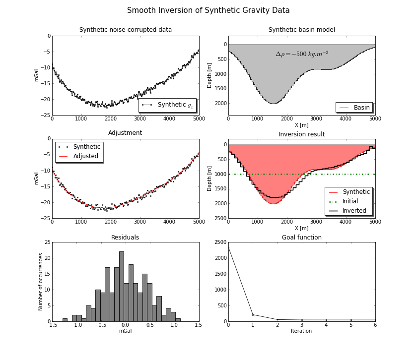

.. fatiando_master:

Welcome!
========

*Fatiando a Terra* is a open source Python package containing various kinds of
geophysical modeling (direct and inverse) and data processing utilities.
It serves as a sandbox for rapidly prototyping of modeling ideas and trying out
algorithms.
We hope that one day it will also serve as a teaching tool for modeling and inverse
problems in geophysics.

*Fatiando* makes heavy use of `Numpy <http://numpy.scipy.org/>`_ for linear algebra
operations and provides a high level interface to visualise our data structures using
`Matplotlib <http://matplotlib.sourceforge.net/index.html>`_ for 2D and
`Mayavi2 <http://code.enthought.com/projects/mayavi>`_ for 3D.
Optimized code is written in Fortran and C and wrapped to Python using Numpy's
f2py. 

For the moment, *Fatiando* is still **under** **development** and there has not been a
release yet. You can checkout our Google Code 
`project site <http://code.google.com/p/fatiando/>`_ for more information.

*Fatiando* is being developed by a group of geophysics graduates from the
Universidade de São Paulo and the Observatório Nacional in Brazil.

Documentation
=============

The *Fatiando* *a* *Terra* docs are currently available in HTML format:

    * :ref:`api`
        Description of the *Fatiando* *a* *Terra* API
        
    * :ref:`cookbook`
        Example scripts of common tasks

A taste of what's comming
=========================

This is an example non-linear gravity inversion run using module
:ref:`InterG2D <inversion_interg2d>`. The inversion was run on synthetic gravity
data generated using module :ref:`fatiando.grav.synthetic <grav_synthetic>`.
The graphs where plotted using module :ref:`fatiando.vis <vis>` as an interface
to `Matplotlib <http://matplotlib.sourceforge.net/index.html>`_.
Bellow is the script used to generate the data, perform the inversion
and make the plot.

[`source code <_static/interg_smooth.py>`_]

